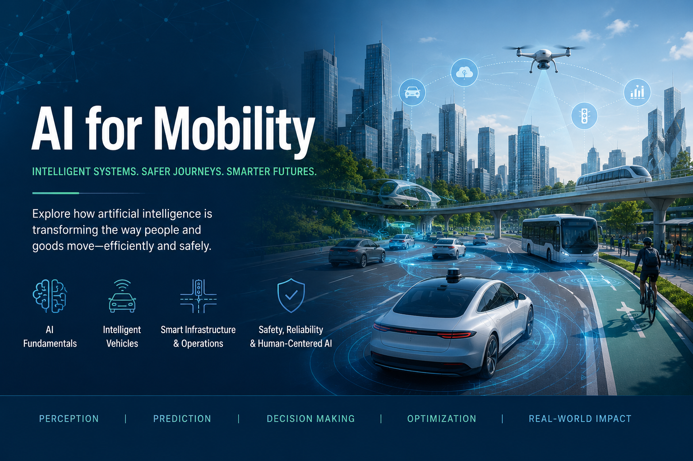

# AI for Mobility

Welcome to **AI for Mobility** — an open graduate-level course on how artificial intelligence is transforming transportation systems. The course is structured as an applied **AI Mobility Systems Studio**: students learn AI foundations, hear from domain experts, work on agency-informed problems, and present solutions to real stakeholders.

## Course Overview

This course is designed for:

- **Graduate students** in transportation engineering, civil engineering, computer science, or related fields who want to understand how AI is reshaping mobility.
- **Practicing transportation engineers** looking to add machine learning and computer vision to their toolkit.
- **Self-learners** anywhere in the world who are curious about AI applications in driving, traffic monitoring, and simulation.

You'll get the most out of the course if you have basic Python familiarity and have seen a probability or linear algebra course at some point. See {doc}`prerequisites` for details.

**By the end of the course** you will be able to explain the major AI methods being applied to mobility problems and where each one fits best; build computer-vision pipelines for traffic monitoring (vehicle detection, tracking, hazard recognition); reason about the role of AI in driving automation (ADAS, autonomous vehicles, V2X connectivity); use AI-augmented traffic simulation tools to test and evaluate transportation interventions; and critically read AI-mobility research papers, identifying where claims are vs. aren't supported.

## Learning Modules

The course is organized into four modules. Each module contains lecture notes, a video walkthrough on YouTube, hands-on lab notebooks (runnable in Google Colab), and recommended readings.

| Module | Topic |
|---|---|
| {doc}`module1/index` | Foundations of AI for Mobility |
| {doc}`module2/index` | AI Sensing for Traffic Monitoring |
| {doc}`module3/index` | AI for Driving Automation and Connectivity |
| {doc}`module4/index` | AI Traffic Simulation and Digital Twin |

## Guest Speakers & Course Contributors

*Bringing academic, industry, and public-sector expertise into the classroom.*

::::{grid} 1 2 3 3
:gutter: 3
:class-container: speaker-grid

:::{grid-item-card}
:class-card: speaker-card
:img-top: _static/headshot-placeholder.svg

Academic Contributor

**Speaker TBA**  
*Affiliation TBA*

**Topic:** Foundation models for mobility

Research on large foundation models applied to transportation perception and planning.
:::

:::{grid-item-card}
:class-card: speaker-card
:img-top: _static/headshot-placeholder.svg

Industry Mentor

**Speaker TBA**  
*Affiliation TBA*

**Topic:** AI deployment in autonomous and connected vehicles

On-road production experience with self-driving and ADAS systems.
:::

:::{grid-item-card}
:class-card: speaker-card
:img-top: _static/headshot-placeholder.svg

Industry Mentor

**Speaker TBA**  
*Affiliation TBA*

**Topic:** Edge AI, sensing, and real-world system integration

Traffic-camera and AI dashcam deployments at scale.
:::

:::{grid-item-card}
:class-card: speaker-card
:img-top: _static/headshot-placeholder.svg

Public-Sector Partner

**Speaker TBA**  
*Affiliation TBA*

**Topic:** Traffic operations and smart corridors

Public-agency perspective on deploying AI in active traffic management.
:::

:::{grid-item-card}
:class-card: speaker-card
:img-top: _static/headshot-placeholder.svg

Guest Speaker

**Speaker TBA**  
*Affiliation TBA*

**Topic:** Reinforcement learning for adaptive signal control

Multi-agent RL methods for coordinated traffic-signal networks.
:::

:::{grid-item-card}
:class-card: speaker-card
:img-top: _static/headshot-placeholder.svg

Industry Mentor

**Speaker TBA**  
*Affiliation TBA*

**Topic:** Computer vision for traffic monitoring

Production vision pipelines for vehicle counting and incident detection.
:::

::::

<a class="cta-button" href="mailto:haozhou1@usf.edu?subject=Guest%20Speaker%20Nomination%20%E2%80%94%20AI%20for%20Mobility">Nominate a Guest Speaker</a>

## Agency Advisory Board & Project Partners

*Connecting student projects with real transportation challenges.*

::::{grid} 1 1 2 2
:gutter: 4
:class-container: advisory-grid

:::{grid-item}

Local transportation agencies and public-sector partners are invited to help shape project topics, provide operational context, review student concepts, and participate in final project presentations. This structure helps students connect AI methods with real-world transportation needs, implementation constraints, and public-sector decision-making.

**We welcome partnerships with:**

- Local transportation agencies
- City and county traffic operations teams
- Regional planning organizations
- Transit agencies
- Industry deployment partners

:::

:::{grid-item}

1

<h4>Problem Discovery</h4>

Agencies introduce real mobility challenges.

2

<h4>Project Scoping</h4>

Student teams translate problems into AI-enabled project ideas.

3

<h4>Mid-Semester Feedback</h4>

Advisors comment on feasibility, data needs, and deployment value.

4

<h4>Final Showcase</h4>

Agencies join final presentations and provide feedback for future development.

:::

::::

<a class="cta-button cta-secondary" href="mailto:haozhou1@usf.edu?subject=Project%20Partner%20Inquiry%20%E2%80%94%20AI%20for%20Mobility">Become a Project Partner</a>

## Student Project Showcase

*Coming soon.* Highlights from final projects developed in partnership with our agency advisors will be published here after each cohort wraps — including a problem brief, methods, results, and a short reflection from the student team.

## How to Use This Site

- **Reading sequentially?** Start at {doc}`prerequisites`, then move through the modules in order. The left sidebar tracks your place.
- **Looking up a specific topic?** Use the search box (top of the sidebar) — it indexes every page.
- **Want to run a lab?** Click the rocket icon at the top of any notebook page and choose "Colab" to launch it in your browser. No local setup required.

## Contact & Get Involved

**Hao Zhou** is an Assistant Professor of Transportation Engineering at the University of South Florida. His research focuses on traffic flow theory, vehicle technologies (ADAS, lane-keeping assist, EVs), and AI applications in mobility — including AI dash cameras for traffic monitoring and road hazard detection.

- Email: [haozhou1@usf.edu](mailto:haozhou1@usf.edu)
- Video lectures: [YouTube — @hao6247](https://www.youtube.com/@hao6247)
- Course site: [ai4mobility.github.io](https://ai4mobility.github.io)

If you'd like to contribute as a guest speaker, partner agency, or collaborator, please reach out via the buttons above or by email.

## License

Course materials are released under the [Creative Commons Attribution 4.0 License](https://creativecommons.org/licenses/by/4.0/) — you're free to use, adapt, and share with attribution. See `LICENSE.md` in the repository for details.
