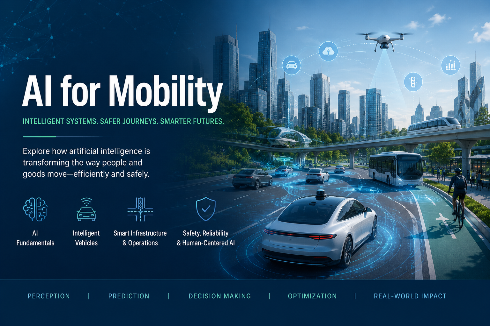

# AI for Mobility

Welcome to **AI for Mobility** — a graduate course at the University of South Florida on how artificial intelligence is transforming transportation systems. The course is structured as an applied **AI Mobility Systems Studio**: students learn AI foundations, hear from domain experts, work on agency-informed problems, and present solutions to real stakeholders. Course materials are openly licensed, so anyone can follow along.

:::{admonition} Fall 2026 offering
:class: tip

**CGN 6933, Section 903** (CRN 85372) · Thursdays, 5:00–7:45 PM · NES 103
First class Thursday, August 27, 2026

No prerequisites and no prior AI coursework required — open to graduate students across
engineering. Full details on the {doc}`syllabus` page.
:::

## Course Overview

This course is designed for:

- **USF graduate students** in transportation engineering, civil engineering, computer science, electrical engineering, or related fields who want to understand how AI is reshaping mobility — and to build things with it.
- **Practicing transportation engineers** looking to add machine learning, computer vision, and AI-assisted workflows to their toolkit.
- **Self-learners** anywhere in the world who are curious about AI applications in driving, traffic monitoring, and simulation.

You'll get the most out of the course if you have basic Python familiarity and have seen a probability or linear algebra course at some point. Advanced programming experience is not required. See {doc}`prerequisites` for details.

**By the end of the course** you will be able to:

- Describe core AI concepts relevant to mobility systems — neural networks, representation learning, transformers, generative models, reinforcement learning, and agentic AI — and identify which mobility problems each is suited to.
- Apply AI tools, notebook-based exercises, and transportation datasets to structured mobility analysis and modeling tasks.
- Interpret model outputs and assess their relevance, limitations, and likely sources of error in transportation applications.
- Read AI-mobility research critically and summarize the problem setting, method, data, findings, and limitations.
- Develop a group project applying an AI method, AI-assisted workflow, or hardware-integrated prototype to a real transportation problem.
- Communicate methods, results, limitations, and practical implications in written and oral form.
- Reason about responsible use of human-in-the-loop AI in transportation: reliability, robustness, safety, privacy, interpretability, human oversight, and professional accountability.

## From Mobility Operations to AI Solutions

This course is organized around a problem-to-solution learning model. Students do not only learn AI algorithms; they learn how to identify real transportation needs, translate them into AI-ready problems, develop feasible solution concepts, and communicate results back to practitioners.

<ol class="workflow-pipeline" aria-label="From mobility operations to AI solutions — five-step workflow">

<li class="workflow-pipeline-step">

1

<h4>Real Mobility Needs</h4>

Agencies, industry partners, and practitioners share operational pain points.

</li>

<li class="workflow-pipeline-step">

2

<h4>Problem Translation</h4>

Students and researchers convert needs into AI-actionable problem statements.

</li>

<li class="workflow-pipeline-step">

3

<h4>AI Methods &amp; Prototypes</h4>

Teams explore computer vision, prediction, optimization, LLMs/VLMs, simulation, and edge AI.

</li>

<li class="workflow-pipeline-step">

4

<h4>Practitioner Feedback</h4>

Agency and industry advisors review feasibility, constraints, data needs, and deployment value.

</li>

<li class="workflow-pipeline-step">

5

<h4>Open Knowledge &amp; Impact</h4>

Results become reusable project briefs, tutorials, open-source tools, and future research directions.

</li>

</ol>

## Learning Modules

Course materials are organized into eight modules across two parts, plus a capstone. Each module contains notes written section by section, a video walkthrough on YouTube, hands-on lab notebooks (runnable in Google Colab), and recommended readings. The module sequence follows the week-by-week schedule on the {doc}`syllabus` page, and every notebook in the course is listed on the {doc}`All Labs <labs>` page.

**Part I — AI foundations through a transportation lens**

| Module | Topic | Weeks | Class dates |
|---|---|---|---|
| {doc}`course-intro` | Course Introduction | 1 | Aug 27 |
| {doc}`module1/index` | Foundations and Representation Learning | 2–3 | Sept 3 · Sept 10 |
| {doc}`module2/index` | Transformers, LLMs, and Multimodal Models | 4 | Sept 17 |
| {doc}`module3/index` | Generative AI and World Models | 5, 13 | Sept 24 · Nov 19 |
| {doc}`module4/index` | Adapting and Orchestrating Models | 6–7 | Oct 1 · Oct 8 |

**Part II — Applied mobility systems**

| Module | Topic | Weeks | Class dates |
|---|---|---|---|
| {doc}`module5/index` | Mobility Sensing and Edge AI | 8–9 | Oct 15 · Oct 22 |
| {doc}`module6/index` | AI for Autonomous Driving and Connectivity | 10 | Oct 29 |
| {doc}`module7/index` | Traffic Simulation, Digital Twins, and Operations | 11 | Nov 5 |
| {doc}`module8/index` | Safety, Agency Practice, and Responsible Use | 12–13 | Nov 12 · Nov 19 |

Weeks 5 and 13 are split sessions: Module 3 supplies the generative-model foundations and the
world-model applications, Module 8 the reliability, cost, and deployment half of Nov 19.

The {doc}`capstone/index` starts in Week 1, runs the whole term, and is worth half the course
grade. Project teams and topics are settled by Sept 17, and from Oct 1 onward most class
meetings open with a rotating team progress report. Final presentations are Dec 3.

## Guest Speakers & Course Contributors

*Bringing academic, industry, and public-sector expertise into the classroom.*

::::{grid} 1 2 3 3
:gutter: 3
:class-container: speaker-grid

:::{grid-item-card}
:class-card: speaker-card
:img-top: _static/headshot-placeholder.svg

Academic Contributor

**Speaker TBA**  
*Affiliation TBA*

**Topic:** Foundation models for mobility

Research on large foundation models applied to transportation perception and planning.
:::

:::{grid-item-card}
:class-card: speaker-card
:img-top: _static/headshot-placeholder.svg

Industry Mentor

**Speaker TBA**  
*Affiliation TBA*

**Topic:** AI deployment in autonomous and connected vehicles

On-road production experience with self-driving and ADAS systems.
:::

:::{grid-item-card}
:class-card: speaker-card
:img-top: _static/headshot-placeholder.svg

Industry Mentor

**Speaker TBA**  
*Affiliation TBA*

**Topic:** Edge AI, sensing, and real-world system integration

Traffic-camera and AI dashcam deployments at scale.
:::

:::{grid-item-card}
:class-card: speaker-card
:img-top: _static/headshot-placeholder.svg

Public-Sector Partner

**Speaker TBA**  
*Affiliation TBA*

**Topic:** Traffic operations and smart corridors

Public-agency perspective on deploying AI in active traffic management.
:::

:::{grid-item-card}
:class-card: speaker-card
:img-top: _static/headshot-placeholder.svg

Guest Speaker

**Speaker TBA**  
*Affiliation TBA*

**Topic:** Reinforcement learning for adaptive signal control

Multi-agent RL methods for coordinated traffic-signal networks.
:::

:::{grid-item-card}
:class-card: speaker-card
:img-top: _static/headshot-placeholder.svg

Industry Mentor

**Speaker TBA**  
*Affiliation TBA*

**Topic:** Computer vision for traffic monitoring

Production vision pipelines for vehicle counting and incident detection.
:::

::::

<a class="cta-button" href="mailto:haozhou1@usf.edu?subject=Guest%20Speaker%20Nomination%20%E2%80%94%20AI%20for%20Mobility">Nominate a Guest Speaker</a>

## Agency Advisory Board & Project Partners

*Connecting student projects with real transportation challenges.*

::::{grid} 1 1 2 2
:gutter: 4
:class-container: advisory-grid

:::{grid-item}

Local transportation agencies and public-sector partners are invited to help shape project topics, provide operational context, review student concepts, and participate in final project presentations. This structure helps students connect AI methods with real-world transportation needs, implementation constraints, and public-sector decision-making.

**We welcome partnerships with:**

- Local transportation agencies
- City and county traffic operations teams
- Regional planning organizations
- Transit agencies
- Industry deployment partners

:::

:::{grid-item}

1

<h4>Problem Discovery</h4>

Agencies introduce real mobility challenges.

2

<h4>Project Scoping</h4>

Student teams translate problems into AI-enabled project ideas.

3

<h4>Mid-Semester Feedback</h4>

Advisors comment on feasibility, data needs, and deployment value.

4

<h4>Final Showcase</h4>

Agencies join final presentations and provide feedback for future development.

:::

::::

<a class="cta-button cta-secondary" href="mailto:haozhou1@usf.edu?subject=Project%20Partner%20Inquiry%20%E2%80%94%20AI%20for%20Mobility">Become a Project Partner</a>

### Suggest a Workflow for Students

Have a real, time-consuming workflow that AI might help with? Tell us about it below. A student team of 3–4 will spend a semester mapping how it works today, finding where AI genuinely helps, building a working prototype with a human in the loop, validating it against your current process, and handing it back with documentation.

The best candidates are tasks that are repetitive, data- or document-heavy, and where a human still makes the final call. You don't need to propose an AI method — a clear description of the operational problem is enough. Prefer to work offline? <a href="_static/AI_for_Mobility_Partner_Intake_Template.docx">Download the intake form (Word)</a>, or post your idea as a <a href="https://github.com/ai4mobility/ai4mobility.github.io/issues" target="_blank" rel="noopener">GitHub issue</a>.

<iframe
  title="AI for Mobility — Suggest a Workflow"
  src="https://docs.google.com/forms/d/e/1FAIpQLScCKF43644uLZDST8DAuU8MICFamktw2FH_vlRubPxhDTjAXQ/viewform?embedded=true"
  loading="lazy">Loading the form…</iframe>

## Open Mobility Challenges

Transportation agencies and industry partners often face practical operational challenges that may benefit from AI, but these problems are not always easy to formulate as research or student project topics. The *Open Mobility Challenges* section provides a structured space to document real-world needs, discuss feasibility, and connect practitioners with students and researchers.

<article class="challenge-card">
<header class="challenge-card-header">
<h4>AI-Assisted Traffic Camera Monitoring</h4>
Example Challenge
</header>
<dl class="challenge-meta">
<dt>Operational context</dt>
<dd>TMC operators monitor many video feeds manually.</dd>
<dt>Possible AI direction</dt>
<dd>Computer vision and vision-language models for incident detection, queue monitoring, and event summarization.</dd>
<dt>Considerations</dt>
<dd>Camera access, false alarms, privacy, operator trust.</dd>
</dl>
<a class="challenge-link" href="https://github.com/ai4mobility/ai4mobility.github.io/issues" target="_blank" rel="noopener" aria-label="Discuss AI-Assisted Traffic Camera Monitoring on GitHub">Discuss on GitHub →</a>
</article>

<article class="challenge-card">
<header class="challenge-card-header">
<h4>Post-Storm Roadway Damage Assessment</h4>
Example Challenge
</header>
<dl class="challenge-meta">
<dt>Operational context</dt>
<dd>Agencies need rapid situational awareness after hurricanes or severe storms.</dd>
<dt>Possible AI direction</dt>
<dd>AI dashcam or drone-based detection of debris, flooding, damaged signs, blocked lanes, and signal outages.</dd>
<dt>Considerations</dt>
<dd>GPS tagging, offline operation, integration with existing reporting workflows.</dd>
</dl>
<a class="challenge-link" href="https://github.com/ai4mobility/ai4mobility.github.io/issues" target="_blank" rel="noopener" aria-label="Discuss Post-Storm Roadway Damage Assessment on GitHub">Discuss on GitHub →</a>
</article>

<article class="challenge-card">
<header class="challenge-card-header">
<h4>Near-Miss and Conflict Analysis</h4>
Example Challenge
</header>
<dl class="challenge-meta">
<dt>Operational context</dt>
<dd>Safety risks often appear before crashes but are difficult to measure systematically.</dd>
<dt>Possible AI direction</dt>
<dd>Video analytics, trajectory extraction, behavior recognition, and surrogate safety metrics.</dd>
<dt>Considerations</dt>
<dd>Camera placement, calibration, data quality, validation.</dd>
</dl>
<a class="challenge-link" href="https://github.com/ai4mobility/ai4mobility.github.io/issues" target="_blank" rel="noopener" aria-label="Discuss Near-Miss and Conflict Analysis on GitHub">Discuss on GitHub →</a>
</article>

<article class="challenge-card">
<header class="challenge-card-header">
<h4>Signal Operations and Anomaly Detection</h4>
Example Challenge
</header>
<dl class="challenge-meta">
<dt>Operational context</dt>
<dd>Signal timing issues, detector failures, and unusual congestion patterns can be hard to diagnose quickly.</dd>
<dt>Possible AI direction</dt>
<dd>Time-series anomaly detection, traffic state prediction, and AI-assisted diagnostic reports.</dd>
<dt>Considerations</dt>
<dd>Signal logs, detector data, probe data, interpretability.</dd>
</dl>
<a class="challenge-link" href="https://github.com/ai4mobility/ai4mobility.github.io/issues" target="_blank" rel="noopener" aria-label="Discuss Signal Operations and Anomaly Detection on GitHub">Discuss on GitHub →</a>
</article>

<article class="challenge-card">
<header class="challenge-card-header">
<h4>Work Zone Safety Monitoring</h4>
Example Challenge
</header>
<dl class="challenge-meta">
<dt>Operational context</dt>
<dd>Agencies need better awareness of risky interactions between vehicles, workers, and temporary traffic control.</dd>
<dt>Possible AI direction</dt>
<dd>Real-time object detection, intrusion detection, and safety alerting.</dd>
<dt>Considerations</dt>
<dd>Edge computing, low-light conditions, false positive management.</dd>
</dl>
<a class="challenge-link" href="https://github.com/ai4mobility/ai4mobility.github.io/issues" target="_blank" rel="noopener" aria-label="Discuss Work Zone Safety Monitoring on GitHub">Discuss on GitHub →</a>
</article>

<a class="cta-button" href="https://github.com/ai4mobility/ai4mobility.github.io/issues" target="_blank" rel="noopener">Submit or Discuss a Mobility Challenge</a>

<em>Practitioners do not need to propose an AI method. A clear description of the operational problem is enough.</em>

## Student Project Showcase

*Coming soon.* Highlights from final projects developed in partnership with our agency advisors will be published here after each cohort wraps — including a problem brief, methods, results, and a short reflection from the student team.

## How to Use This Site

- **Reading sequentially?** Start at {doc}`prerequisites`, then move through the modules in order. The left sidebar tracks your place.
- **Looking up a specific topic?** Use the search box (top of the sidebar) — it indexes every page.
- **Want to run a lab?** Click the rocket icon at the top of any notebook page and choose "Colab" to launch it in your browser. No local setup required.

## Contact & Get Involved

**Hao Zhou** is an Assistant Professor of Transportation Engineering at the University of South Florida. His research focuses on traffic flow theory, vehicle technologies (ADAS, lane-keeping assist, EVs), and AI applications in mobility — including AI dash cameras for traffic monitoring and road hazard detection.

- Email: [haozhou1@usf.edu](mailto:haozhou1@usf.edu)
- Video lectures: [YouTube — @hao6247](https://www.youtube.com/@hao6247)
- Course site: [ai4mobility.github.io](https://ai4mobility.github.io)

If you'd like to contribute as a guest speaker, partner agency, or collaborator, please reach out via the buttons above or by email.

## License

Course materials are released under the [Creative Commons Attribution 4.0 License](https://creativecommons.org/licenses/by/4.0/) — you're free to use, adapt, and share with attribution. See `LICENSE.md` in the repository for details.
